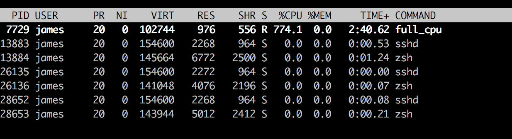
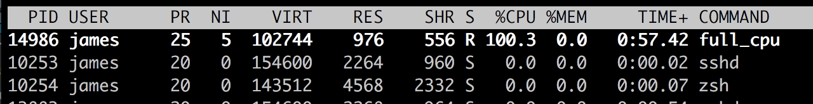

# Docker 基础之 Cgroups

## 背景
 
Cgroups 是 control groups 的缩写，是 Linux 内核提供的一种可以限制、记录、隔离进程组
（process groups）所使用的物理资源（如：cpu,memory,IO 等等）的机制。最初由 google 的
工程师提出，后来被整合进 Linux 内核。Cgroups 也是 LXC 为实现虚拟化所使用的资源管理
手段，可以说没有 cgroups 就没有 LXC。
 
## 用法
本文演示一下 `cgroups` 对 `CPU` 资源的控制。

### 准备程序

```bash
vim full_cpu.go
```

以下程序可以跑满机器的所有核心。
```go
package main

import (
  "flag"
  "runtime"
  "fmt"
)

func main() {
  cpunum := flag.Int("cpunum", 0, "cpunum")
  flag.Parse()
  fmt.Println("cpunum:", *cpunum)
  runtime.GOMAXPROCS(*cpunum)
  for i := 0; i < *cpunum - 1; i++ {
    go func() {
      for {
	  
      }
    }()
  }
  for {

  }
}
```

```bash
go build full_cpu.go

# 查看本机的CPU核心数
nproc

./full_cpu -cpunum `nproc`
```

查看程序的资源消耗

```bash
top -u james
```


### 使用 `Cgroups` 控制 `CPU` 资源

`Cgroups` 子系统介绍：

- blkio -- 这个子系统为块设备设定输入/输出限制，比如物理设备(磁盘，固态硬盘，USB 等 等)。
- cpu -- 这个子系统使用调度程序提供对 CPU 的 cgroup 任务访问。
- cpuacct -- 这个子系统自动生成 cgroup 中任务所使用的 CPU 报告。
- cpuset -- 这个子系统为 cgroup 中的任务分配独立 CPU(在多核系统)和内存节点。 
- devices -- 这个子系统可允许或者拒绝 cgroup 中的任务访问设备。
- freezer -- 这个子系统挂起或者恢复 cgroup 中的任务。
- memory -- 这个子系统设定 cgroup 中任务使用的内存限制，并自动生成由那些任务使用的 内存资源报告。
- net_cls -- 这个子系统使用等级识别符(classid)标记网络数据包，可允许 Linux 流量控制程 序(tc)识别从具体 cgroup 中生成的数据包。
- ns -- 名称空间子系统。

`Cgroups` 的配置默认在 `/sys/fs/cgroup/` 目录下。

#### 建立新组 `mygroup`

```bash
sudo sh -c su root

mkdir /sys/fs/cgroup/cpu/mygroup
ls /sys/fs/cgroup/cpu/mygroup
# cgroup.clone_children  cpuacct.stat          cpu.cfs_period_us  cpu.rt_runtime_us  notify_on_release
# cgroup.event_control   cpuacct.usage         cpu.cfs_quota_us   cpu.shares         tasks
# cgroup.procs           cpuacct.usage_percpu  cpu.rt_period_us   cpu.stat

cat /sys/fs/cgroup/cpu/mygroup/cpu.cfs_period_us
# 100000
cat /sys/fs/cgroup/cpu/mygroup/cpu.cfs_quota_us
# -1
cat /sys/fs/cgroup/cpu/mygroup/tasks
```

只要在 `/sys/fs/cgroup/cpu/` 目录下创建完目录，系统就会自动在我们的目录下增加以上文件。

`cpu.cfs_period_us` 用来配置时间周期长度，`cpu.cfs_quota_us` 用来配置当前 `cgroup` 在设置的周期长度内所能使用的CPU时间数，两个文件配合起来设置CPU的使用上限，如果 `cpu.cfs_quota_us` 的值为 -1(默认值)，表示不受 cpu 时间的限制。。


#### 限制 `CPU` 资源的使用

先来看单核的场景

```bash
./full_cpu -cpunum=1 > /dev/null &
# [1] 14986

top -u james
```
 

把 `CPU` 资源限制在 `10%`。

```bash
sudo sh -c su root
echo 100000 | tee /sys/fs/cgroup/cpu/mygroup/cpu.cfs_period_us
echo 10000 | tee /sys/fs/cgroup/cpu/mygroup/cpu.cfs_quota_us


# 14986 是上文 full_cpu 程序的 PID
echo 14986 | sudo tee /sys/fs/cgroup/cpu/mygroup/tasks

top -u james
```

 

我们再来看看多核的场景

```bash
sudo sh -c su root
echo 100000 | tee /sys/fs/cgroup/cpu/mygroup/cpu.cfs_period_us
echo 10000 | tee /sys/fs/cgroup/cpu/mygroup/cpu.cfs_quota_us

./full_cpu -cpunum=3  > /dev/null &
# [1] 2394

top -u james
```

 


```bash
# 2394 是上文 full_cpu 程序的 PID
echo 2394 > /sys/fs/cgroup/cpu/mygroup/tasks
```

 


这里有一个有意思的地方，`CPU` 配额并没有如我们预期地降低到 `10%`，而是 `210%`，表现上就是我们的配额配置，在同时启动 3 个 `goroutine` 的情况下，只对 1 个 `CPU` 生效了，另外 2 个 `CPU` 完全没有受到影响。这个表现比较诡异，自己查了很多资料也没有找到具体原因，如果有某位看客知道具体原因，还望不吝赐教。


## 其他

### 在 CentOS 上安装 GoLang

```bash
cd /tmp
curl -LO https://storage.googleapis.com/golang/go1.11.linux-amd64.tar.gz

# Compare digest with https://storage.googleapis.com/golang/go1.11.linux-amd64.tar.gz.sha256
sha256sum go1.11.linux-amd64.tar.gz


sudo tar -C /usr/local -xvzf go1.11.linux-amd64.tar.gz
ls /usr/local/go

export PATH=$PATH:/usr/local/go/bin
```
